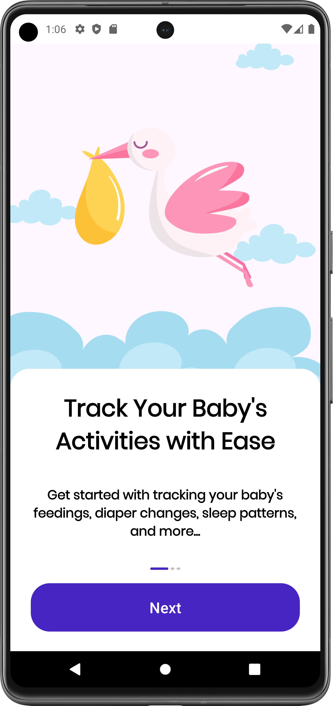
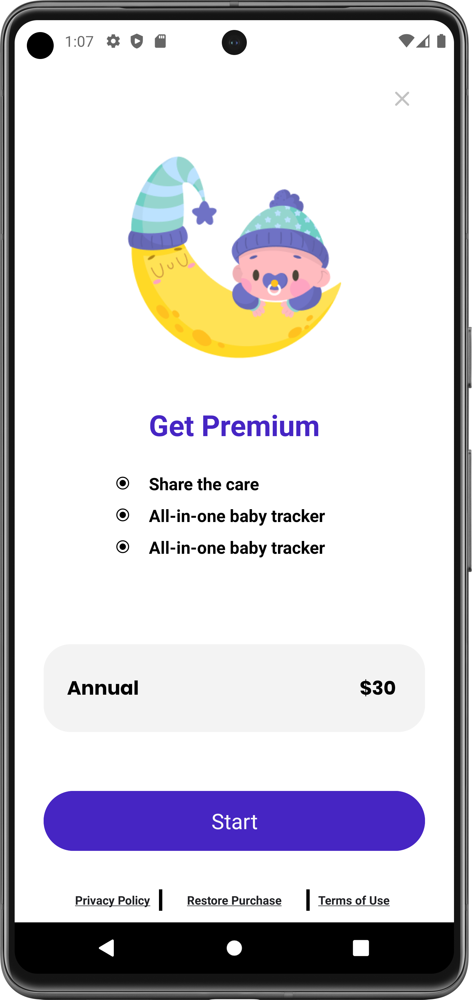
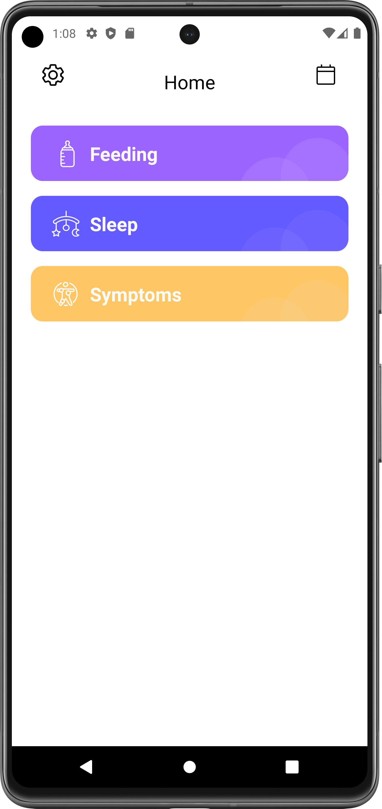
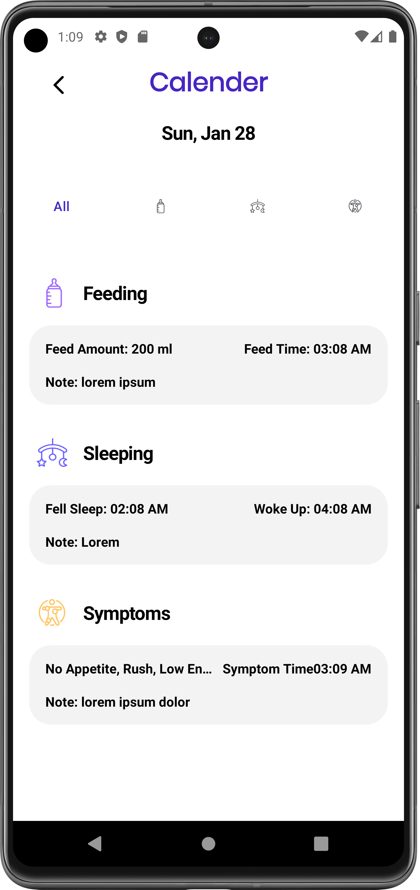

# Baby Tracker

This application includes features that allow parents to record their babies sleeping, feeding, and illness situations, and to list these records by the date of recording.
In this application, MVVM, Dagger-Hilt, Room, RevenueCat, and Navigation libraries have been utilized.

# Libraries

- MVVM
- Room
- Dagger-Hilt
- Live Data
- Coroutines
- Revenuecat

# Screenshots

 

 
